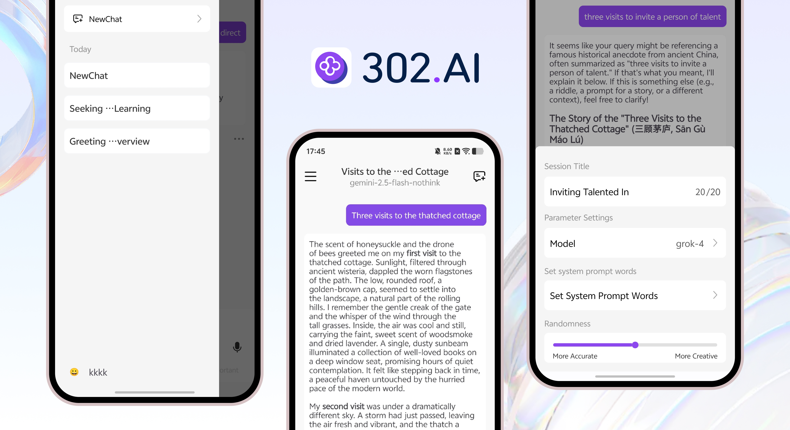

<h1 align="center">

<span>
    302.AI App
</span>
</h1>
 
<p align="center">
<em>302.AI is a powerful AI smart chat application, bringing you a new conversation experience. We integrate various top mainstream AI models on the market, including Deepseek, Qwen, ChatGPT, etc., allowing you to enjoy cutting-edge AI technology in one place.</em>
</p>

<p align="center"><a href="https://github.com/302ai/302.AI-Android-APP-New/releases" target="blank"></a></p >

<div align="center">

[](https://302.ai)
[](https://github.com/302ai/302.AI-Android-APP-New)
[](mailto:support@302.ai)

</div>

<p align="center"><a href="README_zh.md">中文</a> | <a href="README.md">English</a> | <a href="README_ja.md">日本語</a></p>



## 🆕 Brand New Upgrade

In the new version of the 302.AI App, we have comprehensively upgraded the interface and interactive experience, bringing you an even more outstanding visual and operational journey:
- 🌈 Brand new UI design, clearer layout, and smoother interactions
- 🛡️ Added incognito session mode to protect your privacy
- 🌍 Support for multi-language switching to meet diverse user needs
- 🔑 SMS login and password login for 302.AI accounts, more convenient registration and login
- 🌟 More user-friendly optimizations waiting for you to explore

## 🌟 Main Features

### 💬 AI Chat Function (Completely Upgraded)
- 🤖 Multi-model integration: Stop constantly switching apps (Supports Deepseek, Qwen, ChatGPT, Doubao, and many AI models)
- 👍👎 Message like/dislike: Give feedback on AI replies
- 🖼️ Conversation screenshots: One-click capture of long chats
- 📋 Select/copy chat content: Easier operations
- 📚 Contextual memory: Smarter conversations
- 🎯 Custom system prompts
- 🔕 Incognito conversations: Chat content leaves no trace, protecting your privacy

### 🖼️ Image Processing Features
- 📸 Image upload and AI analysis
- 🔍 Intelligent recognition of image content
- 📱 Support for multiple image formats

### 🎙️ Voice Features
- 🎤 Voice input recognition
- 🗣️ Real-time voice-to-text conversion
- 🎵 Audio file support

### 🛠️ Advanced Features
- 🌐 Web search
- 🔍 "Thinking" mode
- 📝 Markdown rendering


## 🚀 Quick Start

### ⚡ Installation and Usage

#### Method 1: Download via GitHub

[Click to Download](https://github.com/302ai/302.AI-Android-APP-New/releases)

#### Method 2: Developer Installation
```bash
# 1️⃣ Clone project
git clone https://github.com/302ai/302.AI-Android-APP-New.git
cd 302.AI-Android-APP-New

# 2️⃣ Open the project using Xcode
open Chat302AI.xcodeproj

# 3️⃣ Configure development team and bundle ID

# 4️⃣ Run Project 🎉
# Select the target device in Xcode and run it
```

## 📄 License

This project is licensed under the [MIT](LICENSE) License, which means you can freely use, modify and distribute it.

## ✨ About 302.AI ✨
[302.AI](https://302.ai) is a pay-as-you-go AI application platform, bridging the gap between AI capabilities and practical implementation.
1. 🧠 Comprehensive AI capabilities: Incorporates the latest in language, image, audio, and video models from leading AI brands.
2. 🚀 Advanced application development: We build genuine AI products, not just simple chatbots.
3. 💰 No monthly fees: All features are pay-per-use, fully accessible, ensuring low entry barriers with high potential.
4. 🛠 Powerful admin dashboard: Designed for teams and SMEs - managed by one, used by many.
5. 🔗 API access for all AI features: All tools are open-source and customizable (in progress).
6. 💡 Powerful development team: Launching 2-3 new applications weekly with daily product updates. Interested developers are welcome to contact us.