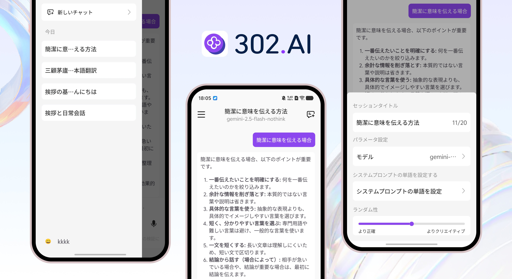

<h1 align="center">

<span>
    302.AI App
</span>
</h1>
 
<p align="center">
<em>302.AIは、強力なAIチャットアプリであり、あなたに新しい会話体験を提供します。Deepseek・Qwen・ChatGPTなど、市場を代表する各種先端AIモデルを集約し、最先端AI技術の魅力をワンストップでお楽しみいただけます。</em>
</p>

<p align="center"><a href="https://github.com/302ai/302.AI-Android-APP-New/releases/download/v1.0.0/302.AI_Android_New_v1.0.0.apk" target="blank"></a></p >

<div align="center">

[](https://302.ai)
[](https://github.com/302ai/302.AI-Android-APP-New)
[](mailto:support@302.ai)

</div>

<p align="center"><a href="README_zh.md">中文</a> | <a href="README.md">English</a> | <a href="README_ja.md">日本語</a></p>



## 🆕 完全リニューアル

新バージョンの302.AIアプリでは、インターフェースと操作体験を全面的にアップグレードし、さらに優れたビジュアルと操作感を実現しました：
- 🌈 全く新しいUIデザイン、より明瞭なレイアウト、よりスムーズな操作
- 🛡️ 新たにシークレットモードを追加し、プライバシーを保護
- 🌍 複数言語の切り替えに対応し、多様なユーザーのニーズに対応
- 🔑 SMSログインとパスワードによる302.AIアカウントへのログインに対応し、より便利な登録・ログイン
- 🌟 他にも多数の細かな最適化、ぜひ体験してください

## 🌟 主な特徴

### 💬 AIチャット機能（完全リニューアル）
- 🤖 複数モデルの統合でアプリ切り替えの頻度を削減（Deepseek・Qwen・ChatGPT・Doubao等多数のAIモデルに対応）
- 👍👎 AI応答へのいいね・バッド評価が可能
- 🖼️ ワンクリックで長い会話のスクリーンショットを取得
- 📋 会話内容の選択・コピーに対応し、操作がより簡単に
- 📚 コンテキスト記憶によるスマートな対話
- 🎯 システムプロンプトのカスタマイズ
- 🔕 シークレットモード対応で会話内容を保存せず、プライバシーを守ります

### 🖼️ 画像処理機能
- 📸 画像アップロードおよびAIによる解析
- 🔍 画像内容のインテリジェント認識
- 📱 複数画像フォーマットに対応

### 🎙️ 音声機能
- 🎤 音声入力認識
- 🗣️ リアルタイム音声テキスト変換
- 🎵 オーディオファイルに対応

### 🛠️ 高度な機能
- 🌐 ウェブ検索機能
- 🔍 思考モード
- 📝 Markdownレンダリング

## 🚀 クイックスタート

### ⚡ インストールと使い方

#### 方法1：GitHubよりダウンロード

[ダウンロードする](https://github.com/302ai/302.AI-Android-APP-New/releases/download/v1.0.0/302.AI_Android_New_v1.0.0.apk)

#### 方法2：開発者のインストール
```bash
# 1️⃣ プロジェクトのクローン
git clone https://github.com/302ai/302.AI-Android-APP-New.git
cd 302.AI-Android-APP-New

# 2️⃣ Xcodeを使用してプロジェクトを開く
open Chat302AI.xcodeproj

# 3️⃣ 開発チームとBundle IDの構成

# 4️⃣ プロジェクトの実行 🎉
# Xcodeでターゲットデバイスを選択して実行
```

## 📄 ライセンス

このプロジェクトは [MIT](LICENSE) ライセンスの下で公開されており、自由に使用、修正、配布することができます。

## ✨ 302.AIについて ✨
[302.AI](https://302.ai)は、AIの能力と実用的な実装の間のギャップを埋める、従量制のAIアプリケーションプラットフォームです。
1. 🧠 包括的なAI機能：主要AIブランドの最新の言語、画像、音声、ビデオモデルを統合。
2. 🚀 高度なアプリケーション開発：単なるシンプルなチャットボットではなく、本格的なAI製品を構築。
3. 💰 月額料金なし：すべての機能が従量制で、完全にアクセス可能。低い参入障壁と高い可能性を確保。
4. 🛠 強力な管理ダッシュボード：チームやSME向けに設計 - 一人で管理し、多くの人が使用可能。
5. 🔗 すべてのAI機能へのAPIアクセス：すべてのツールはオープンソースでカスタマイズ可能（進行中）。
6. 💪 強力な開発チーム：大規模で高度なスキルを持つ開発者集団。毎週2-3の新しいアプリケーションをリリースし、毎日製品更新を行っています。才能ある開発者の参加を歓迎します。